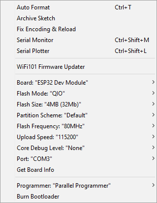

# Ble-Sensing
A Crowd Sensor using ESP32 BLE capabilities and Arduino IDE

## Main Achievements
1. A BLE advertising counter for crowd sensing using ESP32;
2. MQTT integration;
3. Struct to JSON, being then the JsonObject sent to a MQTT broker;
4. Timers and newSightings detection functions;
5. Interaction with Serial Monitor via commands.

## Setup Notes
Unfortunately, the availability (and documentation) of libraries for the ESP32 is significantly lower when compared to the ESP8266. Therefore, the effort to setup both the board and the libraries may be somehow annoying! The following lines describe the main steps:
1. Firstly, you are required to install <i>Arduino ESP32 support</i> on Windows. Fortunately, all the steps, including how to update to the latest code, are clearly described in https://github.com/espressif/arduino-esp32/blob/master/docs/arduino-ide/windows.md ;
2. As we are using several distinct libraries, when uploading the sketch to the board you will surely receive an error message saying there isn't enough memory to deploy it! As workaround, you will need to increase the amount of space available for the program storage. To do that you will need to navigate to <i><ARDUINO_ESP32>/tools/partitions</i> (in my case <i>ARDUINO_ESP32</i> corresponds to <i>C:\Users\user\Documents\Arduino\hardware\espressif\esp32</i>), backup the <i>default.csv</i> file and edit the partitions size.  

")  

Then, navigate to <i><ARDUINO_ESP32>/boards.txt</i> and edit the <i>ESP32 Dev Module</i> maximum size entry. A detailed step-by-step is available in https://desire.giesecke.tk/index.php/2018/04/20/change-partition-size-arduino-ide/ ;  

")  

3. Now that ESP32 is working in Windows and that we have enough memory for big heavy sketches, on the <i>Tools</i> tab define the correct options (board, port, flash, ...);  

  

4. It is now time to install all the required librabries (you will probably just need to install <i>ArduinoJson</i> and <i>PubSubClient</i>, the others should be already installed). Unfortunately (I know, again!), there is a final tweak: the <i>PubSubClient</i> library limits the payload to 128 bytes on the <i>MQTT_MAX_PACKET_SIZE</i> variable. As we may sense several devices, the JSON may get quite big and this space will prevent the payload from being sent to the MQTT broker! You must navigate to <i>..\libraries\PubSubClient\src</i>, open the file entitled as <i>PubSubClient.h</i> and increase the <i>MQTT_MAX_PACKET_SIZE</i> value (I've changed it 4096);
5. Finally, redefine some variables on the sketch, namely the <i>MQTTSERVER</i>, <i>MQTTPORT</i>, <i>MQTTUSER</i>, <i>MQTTPASSWORD</i>, <i>STATION_NETWORK</i> and <i>STATION_PASSWORD</i>, and upload the sketch! Turn on the Serial Monitor for detailed information!

<b>Additional Notes:</b>
- Officially, <i>PubSubClient</i> library only supports ESP8266. Nonetheless, it seems to work fine in ESP32;
- PubSubClient <i>publish()</i> works with a QoS of 0: there are no guarantees data will reach the broker;
- If no WiFi is available then the board will still scan for BLE devices on your request (Scan command);
- If WiFi is available then the timer will start automatically (and will wake up all <i>sendTimer</i> seconds), with a scan time of <i>scanTime</i> seconds;
- As MQTT broker you can use <i>CloudMQTT</i> (they have a free plan) and as client you can use, for example, <i>HiveMQ</i> or even <i>CloudMQTT</i>.

<b>ESP32 restrictions:</b>
As I have said before, ESP32 is still on an embrionary stage. Just to let you know, my first approach was to send the sensed data to <i>Firebase</i>. However, after many battles with different libraries, many problems were arising and I decided to find a new alternative. I decided to send the data over an <i>HTTP POST request</i> to a server running php so that I could store the data. Many problems again, mainly due to BLE and WiFi libraries compatibility (BLEDevice::init was breaking the HTTP request and I couldn't find the reason why). Finally, as last attempt, I decided to send the data to a <i>MQTT Broker</i>, which is now working! 

## Available Commands
You may open the Serial Monitor to get detailed information. 
It also accepts the following commands:
- <b>Stop</b> - stops the handlers that capture the data
- <b>Start</b> - starts the handlers if they have been stopped previously
- <b>Scan</b> - starts a BLE scan
- <b>Count</b> - prints the number of distinct detected devices
- <b>Print</b> - prints the entire list of detected devices
- <b>Clear</b> - clears the entire list of detected devices
- <b>Send</b> - publishes the list of detected devices in JSON to the specified MQTT server
- <b>Start Timer</b> - starts a timer that sends the list of detected devices every *sendTimer* seconds, in JSON, to the specified MQTT server
- <b>Stop Timer</b> - stops the timer
